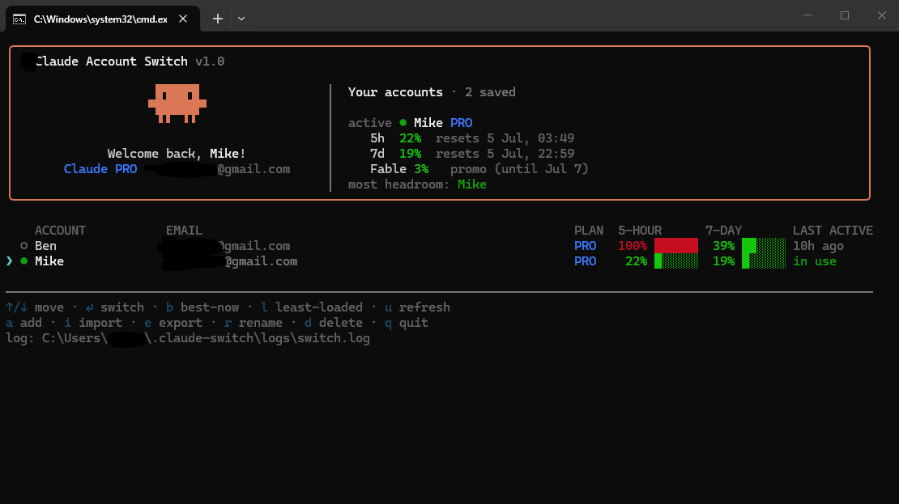

# Claude Account Switch

A fast, keyboard-driven TUI to switch between multiple **Claude Code** accounts —
a *true* switch, with **no re-authorization on the website** each time. Keep several
accounts loaded, see each plan and live usage/quota, and jump between them instantly.



> ⚠️ **Unofficial.** Not affiliated with, or endorsed by, Anthropic. It reads and writes
> the same local credential files Claude Code already uses. The "add account" OAuth flow
> and the usage endpoint rely on **reverse-engineered** behavior that may change at any
> time. Use with accounts **you own**, at your own risk.

## How it works

A logged-in Claude account is really two blobs on disk:

- `~/.claude/.credentials.json` → `claudeAiOauth` (the OAuth tokens + plan)
- `~/.claude.json` → `oauthAccount` (+ root `userID`) (identity metadata)

This tool snapshots those into named **profiles** and swaps them in on demand.
Everything else in your Claude config (MCP tokens, projects, settings) is preserved.
Every change is **backed up first and validated, with automatic rollback** if anything
looks wrong. `~/.claude.json` is edited surgically so nothing else in it is touched.

Because the OAuth tokens aren't tied to the machine, you can also **move accounts
between PCs** (see Import/Export) — no need to install this tool on the other machine.

## Setup

Requires [Node.js](https://nodejs.org) 20+.

```
setup.cmd        # npm install + build (first run only)
switch.cmd       # launch the switcher (also auto-builds on first run)
```

## Keys

| Key | Action |
| --- | --- |
| ↑/↓ | move selection |
| Enter | switch to the selected account |
| b | best-now: switch straight to the account with the most headroom |
| a | add an account (copies the login URL; you authorize, then paste the code) |
| i | import an account from files (another PC) |
| e | export the selected account to a portable file |
| E | export ALL accounts into one file (full backup / whole-PC migration) |
| r | rename the selected account |
| l | highlight the least-loaded account |
| u | refresh usage/quota for all accounts |
| d | delete the selected account |
| q | quit |

Switching optionally auto-closes running `claude` CLI processes (toggle on the confirm
screen with `c`) so the next launch uses the new account — **this switcher stays open**.
In VS Code, run **Developer: Reload Window** afterwards (or it applies on your next
message). The header shows the active account's 5-hour / 7-day usage with local reset
times, and "most headroom" to pick the freshest account.

## Import an account from another PC

You don't need this tool on the other computer. On the source PC, either:

- Run this tool there and press **e** (export) to get a small `*.ccswitch.json` file, **or**
- Copy `~/.claude/.credentials.json` **and** `~/.claude.json`.

On this PC, press **i** — it shows the exact steps, opens the drop folder
(`~/.claude-switch/import/`) with **o**, rescans with **r**, and imports. You're logged
in — no web login.

## Command line

```
switch.cmd login          # add an account via the official `claude` login (robust fallback)
switch.cmd import <path>   # import from a file or folder
switch.cmd --dry-run       # show exactly which keys a switch would change (no writes)
switch.cmd restore         # roll back the last credential change from backup
switch.cmd --help
```

## Files, logs & privacy

Everything lives in `~/.claude-switch/` (outside this repo — **never committed**):

- `profiles.json` — your saved accounts (plain JSON, **no encryption** — keep it private)
- `backups/<timestamp>/` — the live Claude files, backed up before every switch
- `backups/profiles/` — a snapshot of `profiles.json` before every account change
  (add / delete / rename), last 40 kept — so an account can never be lost
- `logs/switch.log` — full activity log (tokens are always **redacted**)
- `import/`, `exports/` — transfer folders

Nothing is ever uploaded anywhere. Tokens only travel to Anthropic's own endpoints
(the same ones Claude Code uses).

## Notes & caveats

- If the native "add account" ever fails (endpoints changed), use `switch.cmd login`.
- The usage endpoint is undocumented and aggressively rate-limited; values are cached ~10 min.
- Quota is shared per organization; "least-loaded" ranks by organization.
- Cross-platform: Windows & Linux use the plain credential files; **macOS** reads/writes
  the Keychain entry Claude Code uses (`Claude Code-credentials`). Profiles are always
  stored as plain JSON — no encryption.
- An account whose refresh token has expired is flagged with a red ⚠; press `a` on it to
  re-authorize just that account.

## License & credits

Created by **LightZirconite**. Licensed under the
[PolyForm Noncommercial License 1.0.0](LICENSE): free to use, modify, and share for
**noncommercial** purposes, but you **may not sell it or use it commercially**, and you
**must keep the attribution** to the original author. Please don't rebrand it as your own.
